# Carbon Foodprint Scanner - Diagrams & Schemas

> Complete technical documentation with all architecture diagrams and validation schemas.

## 📋 Table of Contents

- [Data Flow](#data-flow)
- [Database Schema](#database-schema)
- [ETL Pipeline](#etl-pipeline)
- [Validation Schemas](#validation-schemas)
  - [Barcode Validation](#barcode-validation)
  - [Product Name Validation](#product-name-validation)
  - [Brand Name Validation](#brand-name-validation)
  - [Weight Validation](#weight-validation)
  - [CO2 Data Validation](#co2-data-validation)
  - [Nutriscore Validation](#nutriscore-validation)

---

## Data Flow

Complete data flow in the Carbon Foodprint Scanner system.


### Components

- **OpenFoodFacts API** : Raw data source
- **ProductExtractor** : Product extraction and discovery
- **ProductTransformer** : Data validation and transformation
- **Supabase Database** : Validated data storage
- **Telegram Bot** : User interface
- **Cache** : API responses storage
- **Extraction Analyzers** : Field analysis and quality assessment
- **Quality Analysis Reports** : Comprehensive data quality reports

---

## Database Schema

Complete structure of the `products` table with all fields and constraints.

### Table Structure

| Field | Type | Constraints | Description |
|-------|------|-------------|-------------|
| **barcode** | TEXT | PRIMARY KEY, 8-18 digits | Product identifier |
| **product_name** | TEXT | NOT NULL | Product display name |
| **brand_name** | TEXT | NOT NULL | Brand identifier |
| **brand_tags** | JSONB | Optional | Brand variations |
| **weight** | DECIMAL(10,3) | NOT NULL, >0, ≤50000 | Normalized to grams |
| **product_quantity_unit** | TEXT | NOT NULL, 'g' or 'ml' | Normalized unit |
| **nutriscore_grade** | CHAR(1) | A-E or NULL | Health grade |
| **nutriscore_score** | INTEGER | -15 to 40 or NULL | Health score |
| **eco_score** | CHAR(1) | A-E or NULL | Environmental score |
| **co2_total** | DECIMAL(10,3) | NOT NULL, ≥0, ≤10000 | CO2 per 100g |
| **co2_vehicle_km** | DECIMAL(10,3) | GENERATED | Car equivalent km |
| **co2_train_km** | DECIMAL(10,3) | GENERATED | Train equivalent km |
| **co2_bus_km** | DECIMAL(10,3) | GENERATED | Bus equivalent km |
| **co2_plane_km** | DECIMAL(10,3) | GENERATED | Plane equivalent km |
| **total_co2_impact_grams** | DECIMAL(10,3) | GENERATED | Total CO2 for product |
| **impact_level** | TEXT | GENERATED | LOW/MEDIUM/HIGH/VERY_HIGH |
| **created_at** | TIMESTAMPTZ | Auto | Creation timestamp |
| **updated_at** | TIMESTAMPTZ | Auto | Last update timestamp |
| **cache_expires_at** | TIMESTAMPTZ | Auto | Cache expiration |
| **collection_timestamp** | TIMESTAMPTZ | Optional | Data collection time |
| **transformation_version** | TEXT | Default '1.0' | Processing version |
| **raw_data** | JSONB | Optional | Complete API response |

### Field Categories

#### 🔴 **Critical Fields (NOT NULL)**
- `barcode` : Primary key, 8-18 digits format
- `product_name` : Product name for display
- `brand_name` : Brand name
- `weight` : Weight normalized to grams
- `product_quantity_unit` : Unit (g or ml)
- `co2_total` : CO2 per 100g (main functionality)

#### 🟠 **Required Fields (At least one)**
- `nutriscore_grade` : A-E or NULL
- `nutriscore_score` : -15 to 40 or NULL

#### 🟡 **Optional Fields**
- `eco_score` : A-E or NULL
- `brand_tags` : JSON array
- `collection_timestamp` : Optional
- `raw_data` : Complete API response

#### 🟢 **Generated Fields (Auto-calculated)**
- `co2_vehicle_km` : Transport equivalents
- `co2_train_km` : Train equivalent km
- `co2_bus_km` : Bus equivalent km
- `co2_plane_km` : Plane equivalent km
- `total_co2_impact_grams` : Total CO2 for product
- `impact_level` : LOW/MEDIUM/HIGH/VERY_HIGH

#### ⚪ **System Fields (Auto-managed)**
- `created_at` : Creation timestamp
- `updated_at` : Last update timestamp
- `cache_expires_at` : Cache expiration
- `transformation_version` : Processing version


---

## ETL Pipeline

Detailed ETL pipeline between OpenFoodFacts API and Telegram Bot with all used classes.


### ETL Components & Actions

#### **EXTRACT Phase**
**Classes principales:**
- **OpenFoodFactsClient** : API client with caching
- **WeightParser** : Weight and unit normalization

**Analyzers et reporting:**
- **ExtractionReporter** : Quality reports and missing data analysis
- **ComprehensiveAnalyzer** : Overall field extraction analysis
- **CO2Analyzer** : CO2 data extraction validation
- **BarcodeAnalyzer** : Barcode format and uniqueness analysis
- **TextFieldAnalyzer** : Product name and brand name analysis

#### **TRANSFORM Phase**
**Classes:**
- **DuplicateHandler** : Duplicate detection and management
- **BrandNameCleaner** : Brand name normalization

**Data Normalization Actions:**
- **Product Name Cleaning** : Length limits, whitespace removal
- **Weight Normalization** : Convert all units to grams
- **Unit Normalization** : Standardize to 'g' or 'ml' only
- **Nutriscore Validation** : Validate A-E grades or -15 to 40 scores
- **CO2 Data Extraction** : Extract from multiple sources (agribalyse, ecoscore, nutriments)
- **Transport Calculations** : Calculate car/train/bus/plane equivalents
- **Impact Level Assignment** : Assign LOW/MEDIUM/HIGH/VERY_HIGH based on total CO2

#### **LOAD Phase**
- **DatabaseService** : Database operations and validation

#### **BOT Phase**
- **MessageTemplates** : Bot message formatting
- **BarcodeScanner** : Image processing for barcode detection

---

## Validation Schemas

Detailed validation schemas for each critical field with business rules and fallback chains.

### Barcode Validation

**Rules:**
- Format Check: 8-18 digits only
- Uniqueness: Primary key constraint
- Presence: NOT NULL required

**Fallback Chain:** No fallback - REJECT if invalid


### Product Name Validation

**Overview:** Product name validation is critical for display in the Telegram bot. It ensures users see clean and consistent product names.

**Business Impact:** Validation failure = product not displayable in bot

**Validation Rules:**
- **Presence:** NOT NULL required - Ensure a product name is always present
- **Length:** Non-empty string - Avoid empty strings or whitespace-only strings
- **Language:** French preferred - Prioritize French product names for local users

**Fallback Chain:** product_name_fr → product_name → REJECT

**Source Explanation:**
1. **product_name_fr:** Primary French product name field
2. **product_name:** Generic product name field
3. **REJECT:** Reject if no source is available

**Use Cases:**

✅ **Valid Cases:**
- "Bouchées truffées" → "Bouchées truffées"
- "Chocolat noir" → "Chocolat noir" 

❌ **Invalid Cases:**
- "" (empty string) → REJECT
- NULL → REJECT
- "   " (whitespace only) → REJECT
- "###" (special chars only) → REJECT

**Technical Implementation:**
- **Cleaning:** Remove excessive special characters, normalize spaces
- **Performance:** Real-time validation during extraction
- **Metrics:** Success rate, cleaning rate, fallback usage


### Brand Name Validation

**Overview:** Brand name validation is critical for display in the Telegram bot. It ensures users see clean and consistent brand names.

**Impact Business:** Validation failure = brand not displayable in bot

**Validation Rules:**
- **Presence:** NOT NULL required - Ensure a brand name is always present
- **Length:** Non-empty string - Avoid empty strings or whitespace-only strings
- **Cleaning:** Remove special chars - Normalize brand names for display

**Fallback Chain:** brands → brands_tags[0] → brands_imported → REJECT

**Source Explanation:**
1. **brands:** Primary brand name field
2. **brands_tags[0]:** First brand tag (normalized format)
3. **brands_imported:** Imported brand (external data)
4. **REJECT:** Reject if no source is available

**Use Cases:**

✅ **Valid Cases:**
- "Twix" → "Twix"
- "Nestlé" → "Nestlé"

❌ **Invalid Cases:**
- "" (chaîne vide) → REJECT
- NULL → REJECT
- "   " (espaces uniquement) → REJECT
- "###" (caractères spéciaux uniquement) → REJECT

**Technical Implementation:**
- **Cleaning:** Remove excessive special characters, normalize spaces
- **Performance:** Real-time validation during extraction
- **Metrics:** Success rate, cleaning rate, fallback usage



```mermaid
flowchart TD
    A[Input Data] --> B{Validation Rules}
    B --> C[Rule: Presence NOT NULL]
    B --> D[Rule: Non-empty string]
    B --> E[Rule: Remove special chars]
    
    C --> F{Pass?}
    D --> G{Pass?}
    E --> H{Pass?}
    
    F -->|Yes| I[ACCEPTED]
    F -->|No| J[REJECTED]
    G -->|Yes| I
    G -->|No| J
    H -->|Yes| I
    H -->|No| J
    
    I --> K[Valid Data]
    J --> L[Invalid Data]
    
    M[Fallback Chain:<br/>fallback_chain→REJECT] --> B
    
    style I fill:#98D8C8
    style J fill:#DDA0DD
    style K fill:#98D8C8
    style L fill:#DDA0DD
    style M fill:#FFEAA7
```

### Weight Validation

**Overview:** Weight validation is essential for CO2 calculations per serving. It ensures accurate environmental impact calculations.

**Business Impact:** Validation failure = CO2 calculations impossible

**Validation Rules:**
- **Presence:** NOT NULL required - Ensure weight data is always present
- **Range:** 0 < weight ≤ 50000g - Validate reasonable weight values
- **Normalization:** Convert to grams - Standardize all weight measurements

**Fallback Chain:** Parse number → NULL if failed → REJECT

**Source Explanation:**
1. **Parse number:** Extract numeric value from weight string
2. **NULL:** Set to null if parsing fails
3. **REJECT:** Reject if no valid weight can be determined

**Use Cases:**

✅ **Valid Cases:**
- "250g" → 250 (grams)
- "500ml" → 500 (grams, water equivalent)
- "1kg" → 1000 (grams)
- "0.5kg" → 500 (grams)

❌ **Invalid Cases:**
- "0g" → REJECT (zero weight)
- "60000g" → REJECT (exceeds maximum)
- "abc" → REJECT (non-numeric)
- "" → REJECT (empty string)

**Technical Implementation:**
- **Parsing:** Extract numeric values from various formats (g, kg, ml, etc.)
- **Conversion:** Normalize all weights to grams
- **Validation:** Range check 0-50000g for reasonable values

```mermaid
flowchart TD
    A[Input Data] --> B{Validation Rules}
    B --> C[Rule: Presence NOT NULL]
    B --> D[Rule: Range 0-50000g]
    B --> E[Rule: Convert to grams]
    
    C --> F{Pass?}
    D --> G{Pass?}
    E --> H{Pass?}
    
    F -->|Yes| I[ACCEPTED]
    F -->|No| J[REJECTED]
    G -->|Yes| I
    G -->|No| J
    H -->|Yes| I
    H -->|No| J
    
    I --> K[Valid Data]
    J --> L[Invalid Data]
    
    M[Fallback chain:→<br/>Parse number→<br/>NULL→<br/>REJECT] --> B    
    style I fill:#98D8C8
    style J fill:#DDA0DD
    style K fill:#98D8C8
    style L fill:#DDA0DD
    style M fill:#FFEAA7
```



### CO2 Data Validation

**Overview:** CO2 data validation is critical for environmental impact assessment. It provides the core environmental metrics for the bot.

**Business Impact:** Validation failure = no CO2 impact displayed

**Validation Rules:**
- **Presence:** NOT NULL required - Ensure CO2 data is always present
- **Range:** 0 ≤ CO2 ≤ 10000 - Validate reasonable CO2 values
- **Sources:** Multiple fields - Use various fields from same JSON for reliability

**Fallback Chain:** agribalyse → ecoscore_data → nutriments → REJECT

**Source Explanation:**
1. **agribalyse:** Primary French environmental database
2. **ecoscore_data:** Secondary environmental scoring data
3. **nutriments:** Nutritional data with environmental impact
4. **REJECT:** Reject if no CO2 data available

**Use Cases:**

✅ **Valid Cases:**
- "2.5" → 2.5 (CO2 per 100g)
- "15.8" → 15.8 (CO2 per 100g)
- "0.1" → 0.1 (low impact food)
- "45.2" → 45.2 (high impact food)

❌ **Invalid Cases:**
- "-1" → REJECT (negative CO2)
- "15000" → REJECT (exceeds maximum)
- "abc" → REJECT (non-numeric)
- "" → REJECT (empty string)

**Technical Implementation:**
- **Multi-field:** Extract CO2 from multiple fields in same JSON response
- **Validation:** Range check 0-10000 for reasonable CO2 values
- **Calculation:** Convert to CO2 per 100g standard unit


### Nutriscore Validation

**Overview:** Nutriscore validation helps assess nutritional quality. It provides nutritional scoring for health-conscious users.

**Business Impact:** Validation failure = no nutritional score displayed

**Validation Rules:**
- **Presence:** At least one field - Either grade or score must be present
- **Grade Range:** A-E only - Validate standard Nutriscore grades
- **Score Range:** -15 to 40 - Validate reasonable nutritional scores

**Fallback Chain:** grade OR score required (REJECT if both missing)

**Source Explanation:**
1. **grade:** Nutriscore letter grade (A, B, C, D, E)
2. **score:** Numerical nutritional score (-15 to 40)
3. **REJECT:** Reject if neither grade nor score available

**Use Cases:**

✅ **Valid Cases:**
- "A" → A (excellent nutrition)
- "B" → B (good nutrition)
- "C" → C (average nutrition)
- "D" → D (poor nutrition)
- "E" → E (very poor nutrition)
- Score "15" → 15 (numerical score)

❌ **Invalid Cases:**
- "F" → REJECT (invalid grade)
- "Z" → REJECT (invalid grade)
- "50" → REJECT (score out of range)
- "" → REJECT (empty string)

**Technical Implementation:**
- **Grade validation:** Check for A-E grades only
- **Score validation:** Range check -15 to 40
- **Fallback logic:** Accept either grade or score, reject if both missing


---

## 📋 Usage

### **Documentation Integration**
These diagrams can be integrated into:
- Project README.md
- Technical documentation
- Team wikis
- Presentations

### **Updates**
To regenerate all diagrams:
```bash
python tools/generate_mermaid_diagrams.py
```

### **Recommended Extensions**
- **Markdown Preview Mermaid Support** for Cursor/VS Code
- **Mermaid Preview** for visualization

---

## 🎯 Key Points

### Data Pipeline Architecture
- **Extraction** from OpenFoodFacts API with fallback chains
- **Transformation** with comprehensive business validation
- **Loading** into Supabase with strict constraints
- **User interface** via Telegram Bot with clean data display

### Comprehensive Validation Framework
- **Critical fields** = REJECT if missing (barcode, product_name, brand_name)
- **Fallback chains** applied during extraction phase
- **Data normalization** (weight to grams, brand name cleaning)
- **Multi-source validation** (CO2 from multiple fields in same JSON)
- **Real-time validation** during extraction process

### Enhanced Data Quality
- **Upstream validation** with detailed use cases
- **Cleaning and normalization** with specific rules
- **Rejection of invalid data** with clear business impact
- **Detailed quality reports** with success metrics
- **Comprehensive documentation** for each validation schema

### Validation Schema Improvements
- **Complete use cases** with valid/invalid examples
- **Business impact** clearly defined for each field
- **Technical implementation** details for developers
- **Source explanations** for fallback chains
- **Optimized Mermaid diagrams** with readable labels